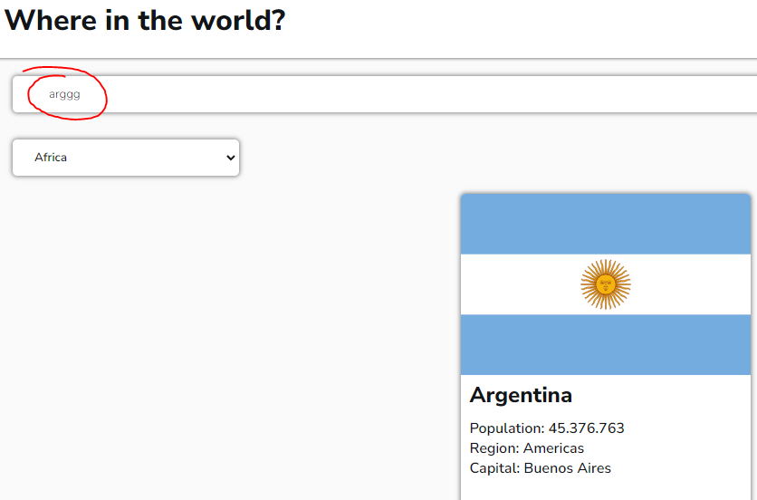
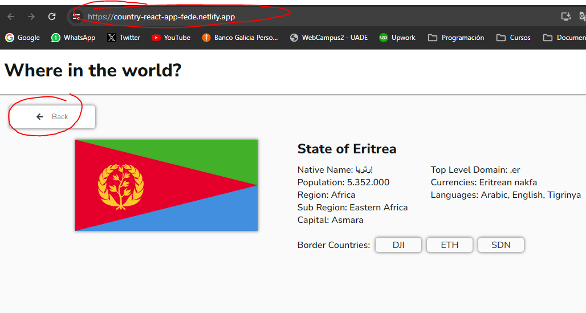
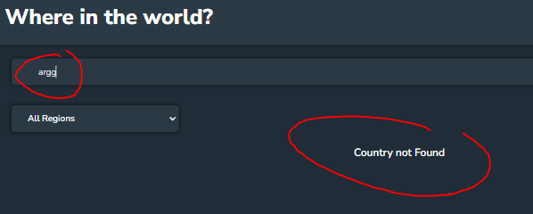
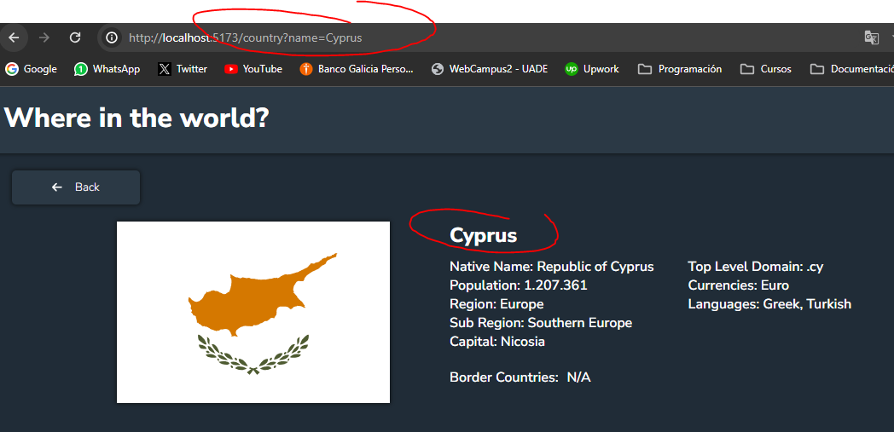
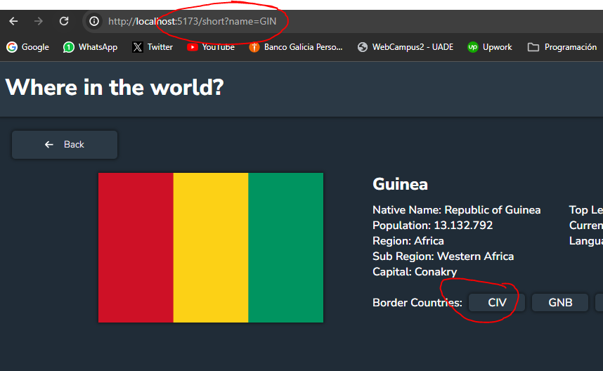

# This is my first challenge from FrontendMentor.io

- In this project  I used ReactJS, HTML5, CSS3, Redux, Redux-Toolkit, React-Router, FontAwesome, Vite.
- I took this challenge just to show my skills. It might has some errors but Im still learning and I will improve.
- In this page you can find different countries with some of their info.
- 

Here are some changes that I made in the last commit:

First we're going to look at the first version of the project:

-The filter was held the last valid input, however, for each character introduced by the user it was calling the API, as consecuence, it ends on a massive data consumption.
-Also, when the user used the input field, the select field sets its value to ""

-The first version had no routing and it still had multiple api calls for each change, that aplies even to the "Back" button.

Now we look at the changes:

-The filter was modified in a way that it only calls the API once, no matter wich filter is aplied.
-Also, it filters now by name AND region.

-Now the app has routing, the user can access to any country following the especific rout.

-Also, the user can access to a country info via its code.

